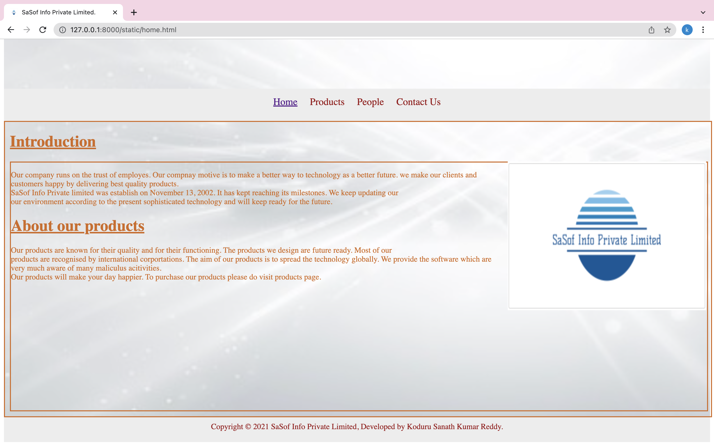
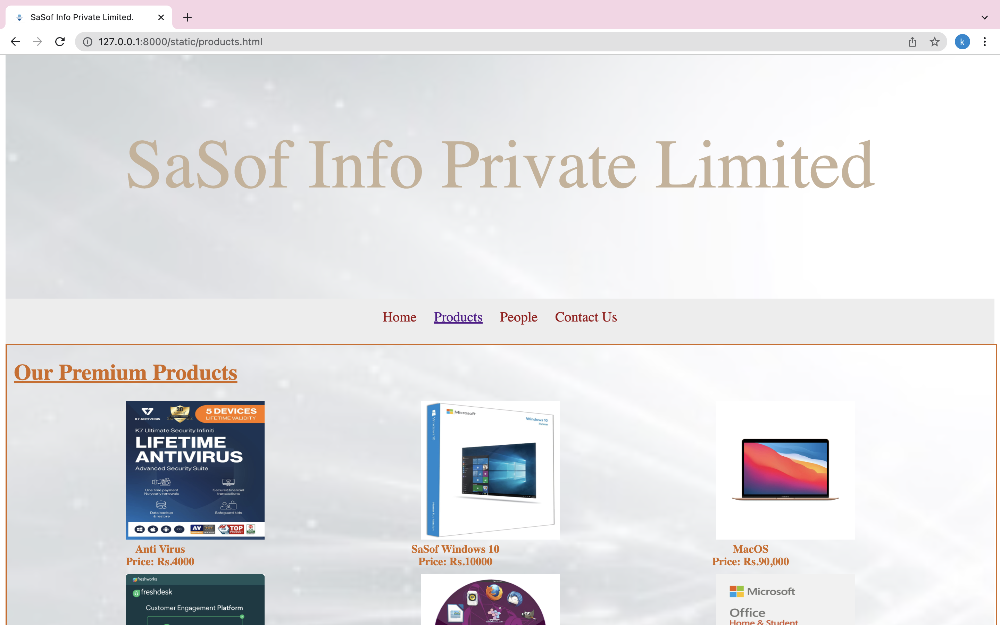
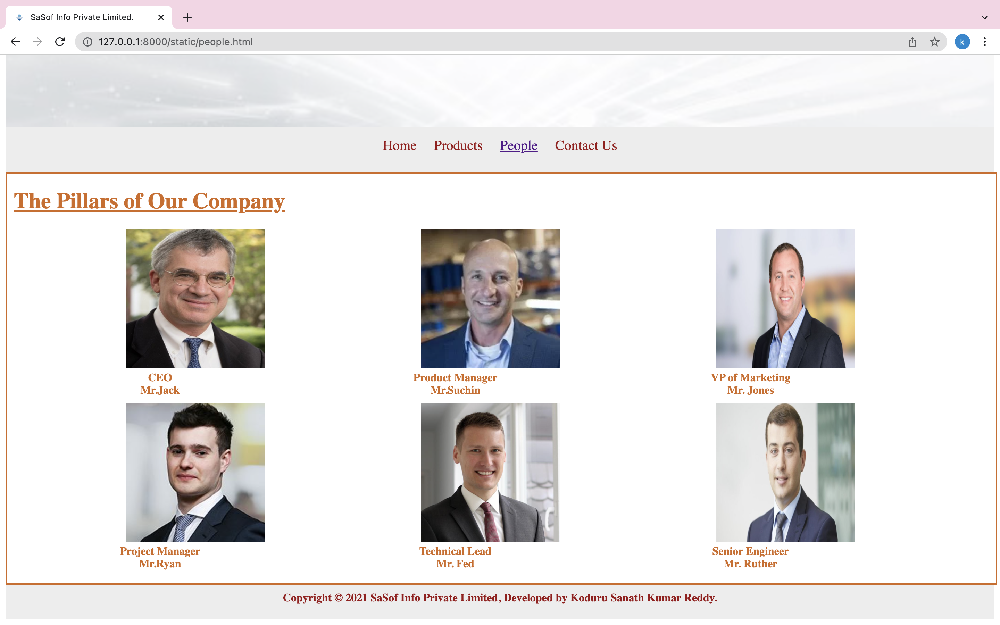

# Web Design for a Software Product Company

## AIM:

To design a static website for a software product company company.

## DESIGN STEPS:

### Step 1:

Requirement collection.

### Step 2:

Creating the layout using HTML and CSS.

### Step 3:

Updating the sample content.

### Step 4:

Choose the appropriate style and color scheme.

### Step 5:

Validate the layout in various browsers.

### Step 6:

Validate the HTML code.

### Step 6:

Publish the website in the given URL.

## PROGRAM :
### home page :
~~~
<!DOCTYPE html>
<html>
    <head>
        <title>SaSof Info Private Limited.</title>
        <link rel="stylesheet" type="text/css" href="css/company.css">
        <link rel="icon" type="image/x-icon" href="/static/images/favicon.ico">
    </head>
    <body>

        

           
SaSof Info Private Limited 
 
           

            
<a href="./home.html">Home</a>

            
<a href="./products.html">Products</a>

            
<a href="./people.html">People</a>

            
<a href="./contacts.html">Contact Us</a>
            

        

        

            

                <h1><b><u>Introduction</u></b></h1>
                

                
                

                    

                          Our company runs on the trust of employes. Our compnay motive is to make a better way to technology as a better future.
                    we make our clients and customers happy by delivering best quality products. 
                     
                            SaSof Info Private limited was establish on November 13, 2002. It has kept reaching its milestones. We keep updating our  
                            our environment according to the present sophisticated technology and will keep ready for the future.
                             
                    <h1><u><b>About our products</b></u></h1>
                    Our products are known for their quality and for their functioning. The products we design are future ready. Most of our 
                    products are recognised by international corportations. The aim of our products is to spread the technology globally.
                        We provide the software which are very much aware of many maliculus acitivities.
                     
                    Our products will make your day happier. To purchase our products please do visit products page.
                        
                

            

        

        

            Copyright &#169; 2021 SaSof Info Private Limited, Developed by Koduru Sanath Kumar Reddy.
            
          

        

        

      </body>
    </html>
    
    </body>

</html>
~~~

### products page:
~~~
<!DOCTYPE html>
<html>
    <head>
        <title>SaSof Info Private Limited.</title>
        <link rel="stylesheet" type="text/css" href="css/company.css">
    </head>
    <body>
        

            
SaSof Info Private Limited 
 
            

             
<a href="./home.html">Home</a>

             
<a href="./products.html">Products</a>

             
<a href="./people.html">People</a>

             
<a href="./contacts.html">Contact Us</a>
             

         

        

            
    
                <h1><b><u>Our Premium Products</u><b></h1>
                

                    
 
                        

                        
                        

                        
Anti Virus

                        
Price: Rs.4000 

                    

                    
 
                        

                        
                        

                        
SaSof Windows 10

                        
Price: Rs.10000 

                    

                    
 
                        

                        
                        

                        
MacOS

                        
Price: Rs.90,000 

                    

                    
 
                        

                        
                        

                        
Customer Support Software

                        
Price: Rs.700 

                    

                    
 
                        

                        
                        

                        
Billing Software/div>
                        
Price: Rs.83,000 

                    

                     
                

                
        
            

            

              Copyright &#169; 2021 SaSof Info Private Limited, Developed by Koduru Sanath Kumar Reddy.
            

          

        </body>
      </html>
~~~

### contacts page:
~~~
<!DOCTYPE html>
<html>
    <head>
        <title>SaSof Info Private Limited.</title>
        <link rel="stylesheet" type="text/css" href="css/company.css">
    </head>
    <body>
        

            
SaSof Info Private Limited 
 
            

             
<a href="./home.html">Home</a>

             
<a href="./products.html">Products</a>

             
<a href="./people.html">People</a>

             
<a href="./contacts.html">Contact Us</a>
             

         

        

            

                <h1><b><u>contact us</u></b></h1>
                
<h4>Mail us at koduru365@gmail.com</h4>

                
<h4>Call us at 5588448833</h4>

                
<h4>We are soon linking to social media.</h4>

                

            

        

        

            Copyright &#169; 2021 SaSof Info Private Limited, Developed by Koduru Sanath Kumar Reddy.
          

        

      </body>
    </html>
    
    </body>

</html>

~~~

### people page:
~~~
<!DOCTYPE html>
<html>
    <head>
        <title>SaSof Info Private Limited.</title>
        <link rel="stylesheet" type="text/css" href="css/company.css">
    </head>
    <body>
        

            
SaSof Info Private Limited 
 
            

             
<a href="./home.html">Home</a>

             
<a href="./products.html">Products</a>

             
<a href="./people.html">People</a>

             
<a href="./contacts.html">Contact Us</a>
             

         

        

            

                <h1><b><u>The backbone of our company are the following members</u></b></h1>
                <ul class="list">
                    <li>The ceo of the company is Koduru Sanath Kumar Reddy</li>
                    <li>The hr of the comapny is Kandukuri Sai Eswar</li>
                    <li>The client manager of the comapy is M.Gautham</li>
                    <li>The resource manager of the company is Adithya</li>
                    <li>Our branch head manager is GV Pavan</li>
                    <li>Capital manager is Vishnu Vardhan</li>
                </ul>
                
                

            

        

        

            Copyright &#169; 2021 SaSof Info Private Limited, Developed by Koduru Sanath Kumar Reddy.
          

        

      </body>
    </html>
    
    </body>

</html>
~~~

### CSS page:
~~~
.toppart{
    border-width: 1080px;
    margin-left: auto;
    margin-right: auto;
    background-image:url("https://image.freepik.com/free-vector/gradient-network-connection-background_23-2148865392.jpg");
    background-repeat: no-repeat;
    background-size: cover;
  

}

.banner{
    display: block;
    font-size:100px;
    text-align: center;
    width: 100%;
    height: 250px;
    padding-top: 150px;
    color:#ccd3ad;

}

.menu {
    display: block;
    width: 100%;
    height: 50px;
    font-size: 20px;
    /** background-image: url("https://encrypted-tbn0.gstatic.com/images?q=tbn:ANd9GcSsQsTSP09KPmp5te9HJARLZvz0w44POVAhMQ&usqp=CAU");**/
    background-color: #EDEDED;
    text-align: center;
    padding-top: 15px;
    margin: 0px 0px 0px 0px;
    border-width: 1px;
  }
  
  .menuitem {
    display: inline-block;
    margin-left: 10px;
    margin-right: 10px;
    font-size: 20px;
  }
  .menuitemselected {
    display: inline-block;
    margin-left: 10px;
    margin-right: 10px;
    color: #16d1ae;
    font-size: 20px;
  }
  
  .menuitem a {
    text-decoration: none;
    color: #9c1018;
  }
  .matter{
      font-size: 50px;
  }

  .content {
    display: block;
    width: 100%;
    color:white;
    min-height: 500px;
    margin: 0px 0px 0px 0px;
    border-width: 2px;
    /*background-image: url("https://image.freepik.com/free-vector/gradient-network-connection-background_23-2148865392.jpg");*/
    background-repeat: no-repeat;
    background-size: conver;
    border-style: solid;
  }
  .homecontent {
    min-height: 500px;
    margin: 10px 10px 10px 10px;
  }
  .homecontent h1 {
    text-align: left;
  }
  .homecontent img {
    float: right;
    width: 400px;
    height: 300px;
    margin-left: 10px;
  }
  
  .contenttext {
    text-align: justify;
    color:grey
  }
  
  .footer {
  display: block;
  width: 100%;
  height: 40px;
  background-color: #EDEDED;
  text-align: center;
  padding-top: 10px;
  margin: 0px 0px 0px 0px;
  color: #9c1018;
}

.productcontent {
  min-height: 500px;
  margin: 10px 10px 10px 10px;
}

.productcontent h1 {
  text-align: left;
}

.productitems {
  display: block;
}

.productitem {
  display: inline-block;
  width: 30%;
  height: 250px;
  text-align: center;
}

.productitem img {
  width: 200px;
  height: 200px;
  display: block;
}
.productitem .itemimage {
  display: block;
  margin-left: auto;
  margin-right: auto;
  width: 100px;
  margin-bottom: 5px;
}

.productitem .itemname {
  display: block;
}
.productitem .itemprice {
  display: block;
}

.list{
  font-size: 20px;
  font-family: 'Gill Sans', 'Gill Sans MT', Calibri, 'Trebuchet MS', sans-serif;
}

~~~

## OUTPUT:

### Home Page:

### Product Page:

### People page:

### contact us page:

## Result:

Thus a website is designed for the software product company and the HTML,CSS code are validated.
